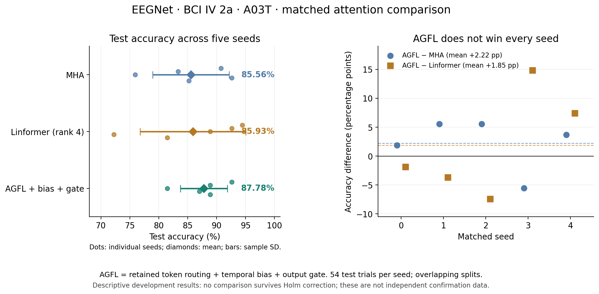

# A03 EEGNet: combined AGFL versus MHA and Linformer

Reviewed 26 September 2026. Source: `/Users/egor/Downloads/report`, session
`eegnet-A03-temporal-gate-baselines-v1`. This is a review of saved cluster
results. No project code, training, inference or project tests ran locally.
No model or experiment settings were changed during this review.

## Result

**Combined AGFL has the highest mean test accuracy: 87.78%, ahead of MHA by
2.22 percentage points and Linformer by 1.85 percentage points.** AGFL here
means retained token routing with both temporal bias and output gating.

| Attention | Test accuracy ± sample SD | Macro F1 | Macro ROC-AUC | Validation accuracy | Parameters |
|---|---:|---:|---:|---:|---:|
| Combined AGFL | **87.78% ± 4.06 pp** | **0.8745** | **0.9730** | 91.85% | 8,324 |
| MHA | 85.56% ± 6.60 pp | 0.8525 | 0.9625 | **92.96%** | 8,036 |
| Linformer, rank 4 | 85.93% ± 9.13 pp | 0.8535 | 0.9652 | 90.74% | 8,260 |

The AGFL scores, selected epochs and confusion matrix exactly reproduce the
previous combined-arm result. This comparison checks reproducibility against
matched baselines. It does not provide an independent new sample of evidence
or raise AGFL's previous 87.78% to 90%.

[Exportable comparison PDF](figures/eegnet_a03_temporal_gate_baselines.pdf).
This standalone figure was made from verified saved results. The downloaded
overview exists, but its long labels overlap; it needs layout improvement
before publication. Its underlying numerical values are correct.

## Seed-level results and errors

Each entry below is the number correct out of 54 test trials. Seeds are
matched across methods; different seeds use overlapping partitions.

| Seed | AGFL | MHA | Linformer | AGFL − MHA | AGFL − Linformer |
|---|---:|---:|---:|---:|---:|
| 0 | 50 | 49 | 51 | +1 | −1 |
| 1 | 48 | 45 | 50 | +3 | −2 |
| 2 | 44 | 41 | 48 | +3 | −4 |
| 3 | 47 | 50 | 39 | −3 | +8 |
| 4 | 48 | 46 | 44 | +2 | +4 |
| Total occurrences | **237** | 231 | 232 | **+6** | **+5** |

AGFL wins four of five seeds against MHA, and two of five against Linformer.
Its mean advantage over Linformer comes from larger gains in seeds 3 and 4;
it does not consistently beat Linformer across seeds. Its observed seed SD
is smaller, but five seeds do not establish a general stability advantage.

Against MHA, AGFL fixes 18 wrong test predictions and loses 12 correct ones.
Against Linformer it fixes 22 and loses 17. These are repeated trial
occurrences, not independent trials: the 270 test occurrences cover only
177 unique samples. Reaching a 90% mean on these partitions would require
another six net correct occurrences, without using test labels for tuning.

| Class | AGFL recall | MHA recall | Linformer recall |
|---|---:|---:|---:|
| Left hand | 88.57% | 84.29% | 88.57% |
| Right hand | 95.71% | 92.86% | 87.14% |
| Feet | 80.00% | 78.46% | 80.00% |
| Tongue | 86.15% | 86.15% | 87.69% |

Feet remains AGFL's weakest class. Thirteen of AGFL's 33 wrong test
occurrences confuse feet and tongue. Compared with MHA its net improvements
are three left-hand, two right-hand and one feet occurrence. Compared with
Linformer it gains six right-hand occurrences and loses one tongue occurrence.

## What this supports for the article

The supported statement is: **on the five tested A03T development splits
with EEGNet, combined AGFL achieved the highest mean test accuracy, macro
F1 and ROC-AUC among the three evaluated attention configurations.**

It does not establish statistically significant superiority. Paired accuracy
t-test p-values are 0.3419 against MHA and 0.6718 against Linformer; both
Holm-adjusted values are 1.0. Wilcoxon accuracy p-values are 0.4375 and 0.875,
also adjusted to 1.0. No supplied comparison across the three metrics survives
Holm correction. Even these seed-level tests are exploratory because splits
overlap and this subject has repeatedly informed development decisions.

MHA has higher validation accuracy (92.96% versus 91.85%) and lower validation
loss (0.12115 versus 0.13310). Therefore AGFL's test lead is not accompanied by
a validation lead over MHA. Do not treat the test table as a model-selection
rule or count this reproduction as five additional independent evaluations.

Keep the combined AGFL recipe fixed for the next evaluation. Independent
confirmation needs untouched evaluation sessions or subjects under a protocol
chosen before examining their outcomes. This within-A03T split is not an
official A03T-to-A03E cross-session result. To attribute the gain specifically
to AGFL, a later controlled comparison should also give MHA the same generic
temporal bias and output gate. This report has no such augmented-MHA control.
It also makes no claim about untested attentions or backbones.

## Artifact audit

- All 15 runs completed all 250 epochs; no failure files or skipped AMP steps.
  Selected checkpoints are the first maximum of validation accuracy, matching
  the configured rule and saved histories.
- Independently recomputed accuracy, macro F1, macro one-vs-rest ROC-AUC and
  confusion matrices from all 30 validation/test prediction arrays. Every
  saved metric matched; probabilities were finite and normalized.
- Each seed shares the exact same split and targets across all three methods:
  162 training, 54 validation and 54 test trials, disjoint within that seed.
  Dataset fingerprint, preprocessing, EEGNet and training settings match.
- Saved data settings use A03T, artifact exclusion, trial-local 2–30 Hz
  filtering, a 1,000-sample cue window and training-channel normalization.
  Attention options differ as declared in the comparison preset.
- All runs and checkpoint diagnostics use source hash
  `08fbacef1ee29736cec2345b1424f1f598728b7b06dd8139d46232d22f943ce2`,
  matching the local Python source at review time. Python, numerical package
  versions, CUDA, cuDNN and GPU model match. Full environment inventories have
  two variants, differing in packaging utilities and platformdirs; they are
  not entirely identical environments.
- All 15 saved diagnostic manifests report successful validation prediction
  replay on the cluster and matching source. Maximum probability discrepancy:
  1.7881e-7. No checkpoint was loaded locally.
- Independently checked saved AGFL graphs, gates, temporal-bias equations,
  diagnostic IDs and validation ablation predictions against their summaries.
- All **116 result figures and 230 diagnostic figures** have nonempty PNG
  and PDF files: **346 pairs**, with no skipped figures. File completeness
  does not imply every plot is publication-ready; the main comparison was
  visually inspected and a readable replacement is linked above.

Original report entry points:

- [Generated result table](/Users/egor/Downloads/report/analysis/report.md)
- [All result plots](/Users/egor/Downloads/report/analysis/figures/index.md)
- [Paired statistics](/Users/egor/Downloads/report/analysis/statistical_comparisons.csv)
- [AGFL seed-2 diagnostics](/Users/egor/Downloads/report/diagnostics/eeg/subject_A03/eegnet-agfl-e31369583cffbe0de724/seed_2/index.md)

These Downloads links refer to the current download and may be replaced by
future reports. The numerical tables and standalone figure in this review
preserve this comparison separately.
