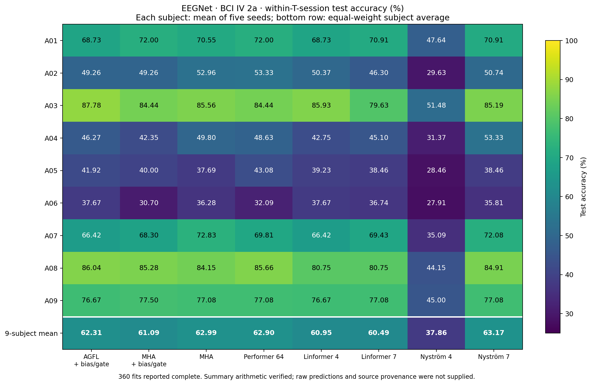

# EEGNet: nine-subject attention comparison

Reviewed 27 September 2026 from `/Users/egor/Downloads/subject_study.json`.
Source SHA256: `181ed3d0e46e9678a94e659e5390aa35db8425774b78e1ffff4e23cd8ff7f032`.

**Augmented AGFL averages 62.31% test accuracy. It exceeds augmented MHA (61.09%) but trails plain MHA (62.99%), Performer (62.90%) and the full-landmark Nyström control (63.17%). The A03 advantage did not generalize into the highest nine-subject mean.**

The supplied summary reports all 360 fits complete, no missing runs and no protocol issues: eight fixed configurations, nine individually trained subjects, five seeds each. The experiment uses the same within-T-session four-class protocol described in the launch guide. This is not official T-to-E session evaluation.

## Equal-weight averages

Average seeds within each subject first, then weight all nine subjects equally. The SD below is between subject means, not seed SD, a confidence interval or standard error.

| Attention | Test accuracy ± between-subject SD | Validation accuracy | Test macro F1 | Test macro ROC-AUC |
|---|---:|---:|---:|---:|
| Nyströmformer (7 landmarks) | 63.17% ± 19.04 pp | 71.38% | 0.6229 | 0.8356 |
| Plain MHA | 62.99% ± 19.16 pp | 71.35% | 0.6202 | 0.8333 |
| Performer (64 features) | 62.90% ± 19.21 pp | 71.89% | 0.6218 | 0.8395 |
| Augmented AGFL | 62.31% ± 19.12 pp | 70.75% | 0.6158 | 0.8309 |
| Augmented MHA | 61.09% ± 20.71 pp | 70.58% | 0.6040 | 0.8316 |
| Linformer (rank 4) | 60.95% ± 18.74 pp | 70.22% | 0.6020 | 0.8281 |
| Linformer (rank 7) | 60.49% ± 18.47 pp | 69.23% | 0.5955 | 0.8197 |
| Nyströmformer (4 landmarks) | 37.86% ± 9.20 pp | 49.11% | 0.3500 | 0.6724 |

Seven Nyström landmarks equal the seven EEGNet tokens; this implementation takes its dense-attention limit. Its 63.17% is a reference control, not evidence of a fundamentally different attention mechanism outperforming MHA. The four-landmark approximation performs poorly under this fixed recipe; do not generalize that result to every Nyströmformer implementation or setup.

## Direct answers

- AGFL versus augmented MHA: **+1.21 pp**, five subject wins, one tie, three losses.
- AGFL versus plain MHA: **−0.68 pp**, four subject wins and five losses.
- AGFL versus Performer: **−0.60 pp**, three wins and six losses.
- AGFL versus Linformer rank 4: **+1.36 pp**, four wins, four ties and one loss.
- AGFL versus Linformer rank 7: **+1.82 pp**, six wins and three losses.
- Augmented MHA versus plain MHA: **−1.90 pp**, four wins and five losses. The additions do not universally improve attention accuracy.
- No unaugmented token-AGFL arm was run across all nine subjects. This study cannot isolate whether AGFL benefits from the additions on average across subjects; its earlier four-arm ablation applies to A03.

## Subject breakdown

[Vector PDF](figures/eegnet_nine_subject_accuracy.pdf).

| Subject | Augmented AGFL | Plain MHA | Augmented MHA | AGFL − plain MHA |
|---|---:|---:|---:|---:|
| A01 | 68.73% | 70.55% | 72.00% | -1.82 pp |
| A02 | 49.26% | 52.96% | 49.26% | -3.70 pp |
| A03 | 87.78% | 85.56% | 84.44% | +2.22 pp |
| A04 | 46.27% | 49.80% | 42.35% | -3.53 pp |
| A05 | 41.92% | 37.69% | 40.00% | +4.23 pp |
| A06 | 37.67% | 36.28% | 30.70% | +1.40 pp |
| A07 | 66.42% | 72.83% | 68.30% | -6.42 pp |
| A08 | 86.04% | 84.15% | 85.28% | +1.89 pp |
| A09 | 76.67% | 77.08% | 77.50% | -0.42 pp |

A03 remains exactly 87.78%, so the new overall average is not an A03 regression. A08 also reaches 86.04%. The mean changes because it now includes the other seven subjects, especially A02 (49.26%), A04 (46.27%), A05 (41.92%) and A06 (37.67%). These are also difficult for the other methods in this experiment. A06 has AGFL tied with Linformer rank 4 for the best mean despite its low absolute accuracy.

A07 has the largest AGFL loss to plain MHA: −6.42 pp; A05 has its largest gain: +4.23 pp. These observed differences describe heterogeneity and do not authorize subject-specific tuning using these test results.

Mean AGFL validation accuracy is 70.75%, compared with 62.31% test accuracy, an 8.44 pp gap. Plain MHA shows a similar gap (71.35% versus 62.99%). Validation was used for checkpoint selection; this difference alone cannot distinguish ordinary selection optimism, overfitting, weak signal or a preprocessing problem.

## Statistical interpretation

The report uses nine paired subject means, not 45 subject/seed rows. It corrects a family of 24 comparisons (eight contrasts × accuracy, F1 and ROC-AUC), separately for paired t and Wilcoxon tests.

| Accuracy contrast | Raw paired t p | Holm t p | Raw Wilcoxon p | Holm Wilcoxon p |
|---|---:|---:|---:|---:|
| Augmented AGFL − Augmented MHA | 0.28629 | 1.00000 | 0.31250 | 1.00000 |
| Augmented AGFL − Plain MHA | 0.56839 | 1.00000 | 0.73438 | 1.00000 |
| Augmented AGFL − Performer (64 features) | 0.59777 | 1.00000 | 0.49609 | 1.00000 |
| Augmented AGFL − Linformer (rank 4) | 0.08910 | 1.00000 | 0.12500 | 1.00000 |
| Augmented AGFL − Linformer (rank 7) | 0.16497 | 1.00000 | 0.20312 | 1.00000 |
| Augmented AGFL − Nyströmformer (4 landmarks) | 0.00018 | 0.00396 | 0.00391 | 0.09375 |
| Augmented AGFL − Nyströmformer (7 landmarks) | 0.49745 | 1.00000 | 0.73438 | 1.00000 |
| Augmented MHA − Plain MHA | 0.14396 | 1.00000 | 0.30078 | 1.00000 |

AGFL has no statistically established accuracy advantage over MHA, augmented MHA, Performer or either Linformer setting. The contrast with the weak four-landmark Nyström baseline survives Holm correction for the paired t-test (accuracy p=0.00396; F1 and ROC-AUC also survive). Its exact Wilcoxon adjusted p=0.09375 does not. No Wilcoxon contrast survives the correction. Report the prespecified tests together rather than choosing whichever supports the desired claim.

Failure to detect a difference does not demonstrate equivalence or noninferiority. A03 and other previously inspected subjects informed development, so the full nine-subject study is not wholly independent confirmation.

## Article and next investigation

These results can be included as a transparent comparative evaluation. They do not support a claim that augmented AGFL generally improves accuracy over standard attention. A supported descriptive statement is that its 62.31% average lies 0.68 pp below plain MHA and 1.21 pp above augmented MHA under the fixed EEGNet recipe. Retain all baseline and subject outcomes.

The next useful investigation is the shared accuracy limitation on A02/A04/A05/A06 and the AGFL-specific deficit on A07, using already saved training/validation histories and per-class results. This summary cannot establish the cause, and does not justify another architecture change by itself. Checkpoint t-SNE diagnostics are not required to establish the current ranking. Future improvements should be selected using training/validation information and confirmed on evaluation data not repeatedly used to choose the recipe.

## What was independently checked

- All 432 supplied subject/partition/metric rows declare five completed seeds and finite scores in [0,1].
- Recomputed all 48 overall means and between-subject sample SDs from those rows; all matched.
- Recomputed all 24 subject contrasts, every subject delta, all paired t p-values and all 48 Holm-adjusted p-values; all matched.
- Independently enumerated all sign assignments for the nonzero ranked subject differences (at most 512 assignments) to verify all 24 exact Wilcoxon statistics and p-values, including ties and zero differences. The locally installed SciPy auto mode uses an approximation for some zero-containing vectors; exact enumeration avoids that version-dependent default.
- The supplied file has no per-seed prediction arrays, histories, checkpoint records or full source provenance. The original seed metrics, actual epoch completion, split integrity and checkpoint selection were not independently re-audited. Complete-run/protocol status is reported by the exported summary.
- No project code, training, model inference or project tests ran locally. No model, preset or training setting was changed. Only standalone saved-summary analysis and review artifacts were created.
